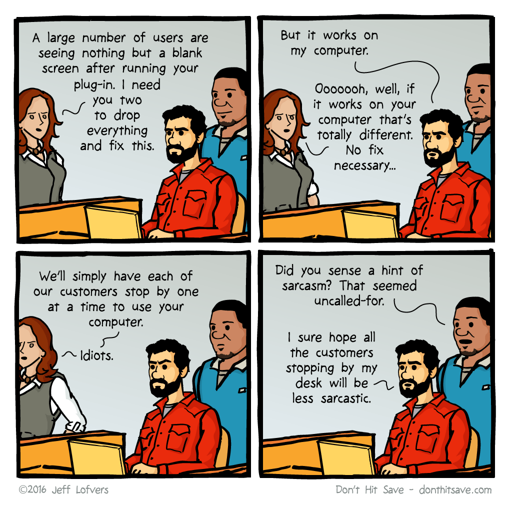

# Docker

Docker is a fantastic tool, using virtual networks, cgroups, namespaces, etc, to securely install and set up applications in code.
This means we can set up and test an idea in a test-environment, and to easily reproduce the results on the LAN.

Docker is used for [lancache](lancache.md).

