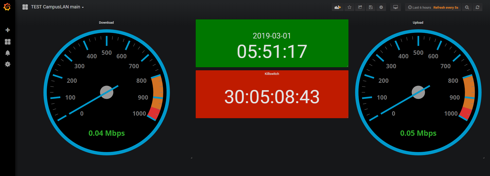
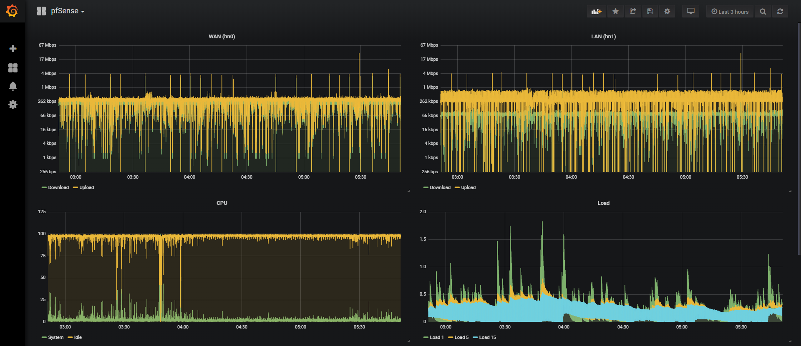
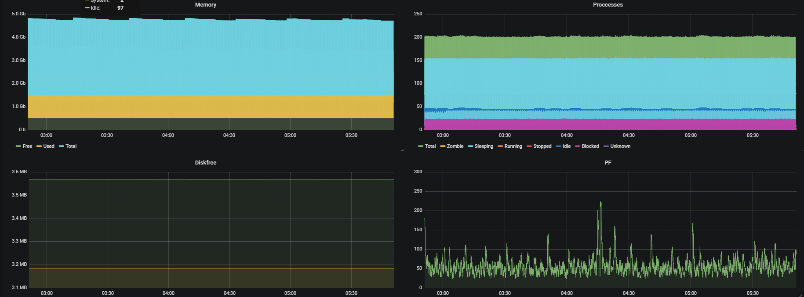

Hosted on port 3000 on [server-Y](devices/Y.md)
Grafana takes metrics from influxdb and provides them to custom dashboards and alerting. This enables us to monitor the health of the network and devices, and to diagnose and service issues (preferably before users notice).

Dashboards can be made available to anyone, or to specific users and teams. Generally speaking, preference should be given to dashboards that can be made available to anyone.

NOTE: Some of the dashboards might need updating to better suit the specs of the LAN (compared to the testing-environment).

The main dashboard (shown above) provides basic information about the LAN, taking upload and download speed (from X), the current time and a countdown to killswitch (to change the killswitch-time, edit the panel). This design is preliminary, for production it should be renamed ("TEST" removed from the name) and the "speedometers" should be updated to match the max capacity of the link going out of the house.

The pfSense dashboard (part 1 of which is shown above) provides basic information about the pfSense box. This design is preliminary, it assumes the one interface each for LAN and WAN.

Note: Load1 is the average load the last minute, Load 5 over last 5 and Load 15 the last 15.

The pfSense dashboard (part 2 of which is shown above) also provides more "nerdy" details about the pfSense-box.